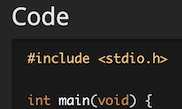

# Task 5: Get a status badge

You are going to update this web page: `https://csci3251-2023.github.io/`*`(repo name)`* 
 
(of course it's your actual repo name, without the brackets!)

As the **Delivery Manager**, go through these steps:

1. Edit readme.md, and include the code from *`code.c`* using `include_relative`
2. Highlight the code using C syntax highlighting with markdown, like this:\
	
3. Now, get a workflow status badge for the code, as in this document: https://docs.github.com/en/actions/monitoring-and-troubleshooting-workflows/adding-a-workflow-status-badge
	* The code should already be well prepared in Task 4
	* The *owner* is _csci3251-2023_, and the *repository* is your team repo name
	* You can find the *workflow file name* in the repo in `.github/workflows` directory
4. Insert the resultant image using markdown, under the code snipplet you inserted

_You may find this page useful: https://jekyllrb.com/docs/includes/_

##### Unfortunately, since your repo is private, you'll see the badge in the repo view (under github.com), but not the web view (under github.io)
