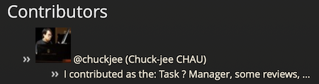

# Task 6: Showcase your team

You are going to update this web page: `https://csci3251-2023.github.io/_(repo name)_`

As the **Personnel Manager**, here are your tasks:

1. Edit **`readme.md`**
2. Under **Contributors**, use a loop in the folder `_stu` (Jekyll collection `stu`) to go through all files
3. Show these information from the files:
	* image
	* user
	* name
	* content
4. Arrange the contents so that it looks like this:\
	
	* Everyone in your team should add their information to corresponding md files in the `_stu` folder
5. Remove the demo file `1155000000.md` when there are real files in `_stu`

(Feel free to enhance the page outlook by changing the theme, or preparing new CSS!)

_You may find this page useful: https://jekyllrb.com/docs/collections_

#### Note: This task is not easy, since you cannot preview the changes in Jekyll until your edits are approved. It is better if you test in another repo owned by you.

##### GitHub Page is a great tool for developers, learn more here: [https://lab.github.com/githubtraining/github-pages](https://github.com/skills/github-pages)
